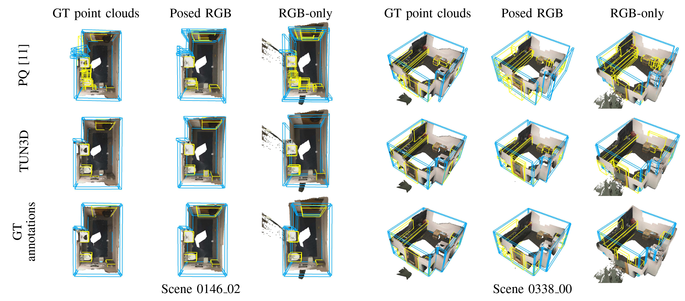
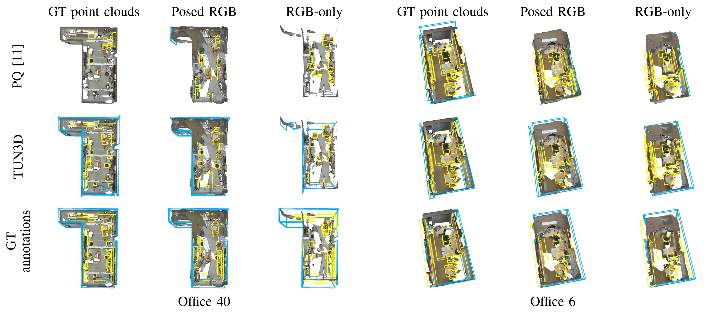

# TUN3D: Towards Real-World Scene Understanding from Unposed Images
[](https://bulatko.github.io/tun3d/)
[]()
[](https://huggingface.co/maksimko123/TUN3D/tree/main)
### 📰 News
- :fire: **September 2025** — Initial release of **TUN3D**!  

This repository contains an implementation of TUN3D, a method for real-world indoor scene understanding from multi-view images.

<div align="center">
  <video src="https://github.com/user-attachments/assets/5ca75a1c-6259-48a5-8bf2-2f7ea7fe31a2"> </video>
  <p><i>TUN3D works with GT point clouds, posed images (with known camera poses), or fully unposed image sets (without poses or depths).</i></p>
</div>

> **TUN3D: Towards Real-World Scene Understanding from Unposed Images**<br>
> [Anton Konushin](https://scholar.google.com/citations?user=ZT_k-wMAAAAJ)
> [Nikita Drozdov](https://github.com/anac0der),
> [Bulat Gabdullin](https://github.com/bulatko),
> [Alexey Zakharov](https://github.com/Alex1099000),
> [Anna Vorontsova](https://github.com/highrut),
> [Danila Rukhovich](https://github.com/filaPro),
> [Maksim Kolodiazhnyi](https://github.com/col14m)
> <br>
> https://arxiv.org/abs/2509.21388


### Installation

**The repository is divided into two modules:**

1. **[Reconstruction](./reconstruction/)**
2. **[Recognition](./recognition/)**

Each module requires a separate installation of dependencies. Please follow the installation guide provided in each module’s directory.

### Data preprocessing

* Preprocessing instructions and scripts are located in the corresponding folders: **[`Scannet`](./data/scannet/)**, **[`S3DIS`](./data/s3dis/)**, **[`Structured3d`](./data/structured3d/)**.
* All preprocessed datasets are also available on **Hugging Face**. The installation guide provides detailed steps on how to download them correctly.


### Running 

After completing the data preprocessing stage, navigate to the [`recognition`](./recognition/) folder and follow the instructions provided there.

### Predictions example

#### ScanNet

<p float="left">
  
</p>

#### S3DIS
<p float="left">
  
</p>

### Citation

If you find this work useful for your research, please cite our paper:

```
@misc{konushin2025tun3drealworldsceneunderstanding,
      title={TUN3D: Towards Real-World Scene Understanding from Unposed Images}, 
      author={Anton Konushin and Nikita Drozdov and Bulat Gabdullin and Alexey Zakharov and Anna Vorontsova and Danila Rukhovich and Maksim Kolodiazhnyi},
      year={2025},
      eprint={2509.21388},
      archivePrefix={arXiv},
      primaryClass={cs.CV},
      url={https://arxiv.org/abs/2509.21388}, 
}
```